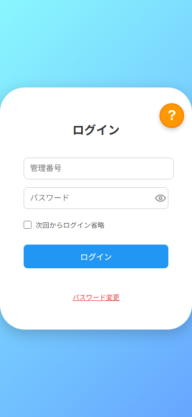
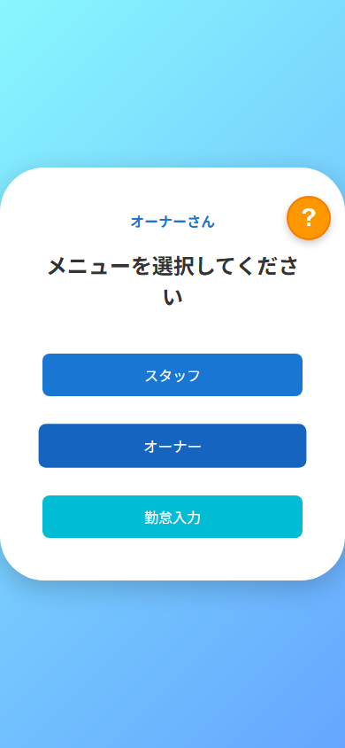
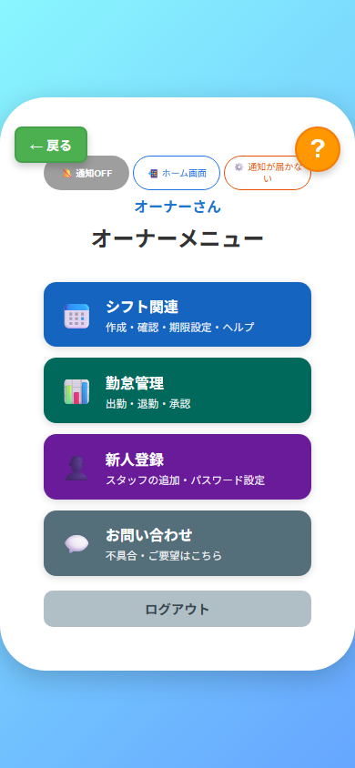
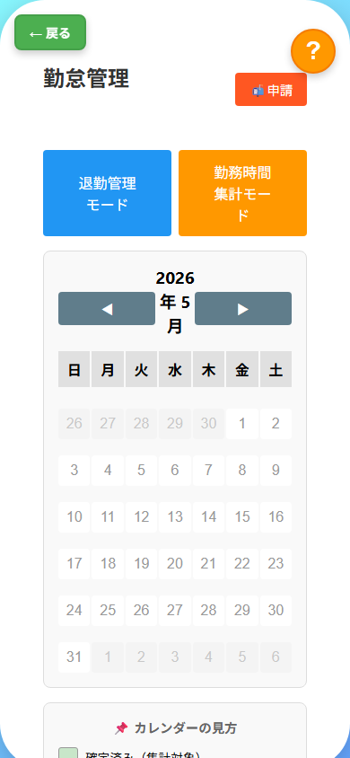

<div align="center">

# 🗓️ OzoShift（オゾシフ）

**スマホだけで完結する、シフト・勤怠管理 PWA アプリ**

[](https://react.dev/)
[](https://web.dev/progressive-web-apps/)
[](https://supabase.com/)
[](https://pages.cloudflare.com/)
[](./LICENSE)

飲食・小売・サービス業の中小店舗向けに開発した、追加費用なしで運用できるシフト・勤怠管理システムです。

</div>

---

## 📸 スクリーンショット

<div align="center">

| ログイン | メニュー | オーナー管理 | 勤怠管理 |
|:---:|:---:|:---:|:---:|
|  |  |  |  |

</div>

---

## ✨ 主な機能

| 機能 | 概要 |
|------|------|
| 📅 シフト希望提出 | スタッフがスマホから希望日・時間帯を選択して提出 |
| 🗂 シフト作成 | オーナーがスタッフの希望を見ながらシフトを確定・公開 |
| ⏱ 勤怠打刻 | 出勤・退勤・休憩をダブルタップで記録 |
| 📋 打刻履歴・修正申請 | スタッフが履歴確認・修正申請、オーナーが承認 |
| 📊 就労時間集計 | 月次の就労時間を一覧・確定・CSV連携 |
| 🔔 プッシュ通知 | シフトリマインダー・打刻忘れアラート（Web Push） |
| 🔒 セキュリティ | SHA-256パスワードハッシュ / Supabase RLS |

---

## 🛠 技術スタック

| レイヤー | 技術 | 選定理由 |
|---------|------|---------|
| フロントエンド | React 19 / PWA | スマホでネイティブアプリのように動作 |
| バックエンド | Supabase (PostgreSQL) | リアルタイムDB + REST API + 認証を即時構築 |
| Edge Functions | Supabase Deno Functions | プッシュ通知の定時配信をサーバーレスで実現 |
| デプロイ | Cloudflare Pages | GitHub連携で自動ビルド・グローバルCDN配信 |
| プッシュ通知 | Web Push API (VAPID) | iOS/Android両対応の標準仕様で実装 |
| テスト | Playwright | E2Eで全フロー（登録〜打刻〜承認）を自動検証 |

---

## 🏗 システム構成

```
[スマホ / PC ブラウザ]
        │  HTTPS
        ▼
[Cloudflare Pages]  ← GitHub push で自動ビルド
  React PWA (SPA)
        │  REST API / Realtime
        ▼
  [Supabase]
  ├── PostgreSQL（users / shifts / attendance / corrections）
  ├── Edge Functions（定時プッシュ通知）
  └── Storage

[cron-job.org] ──定期PING──▶ Edge Functions
```

---

## 🚀 ローカル起動

```bash
git clone https://github.com/joudencompany/ozoshift.git
cd ozoshift
npm install
npm start
# → http://localhost:3000
```

---

## ⚙️ 新店舗へのデプロイ手順

### 1. Supabase プロジェクトを作成

[supabase.com](https://supabase.com) でプロジェクトを作成し、以下を取得：
- **Project URL** （例: `https://xxxxxxxxxx.supabase.co`）
- **anon / public キー**

### 2. 接続情報を書き換え

`src/supabaseClient.js`：
```js
const supabaseUrl = 'https://xxxxxxxxxx.supabase.co';  // ← 変更
const supabaseAnonKey = 'eyJ...';                        // ← 変更
```

`public/service-worker.js`（3〜4行目）：
```js
const SUPABASE_URL = 'https://xxxxxxxxxx.supabase.co';  // ← 変更
const SUPABASE_ANON_KEY = 'eyJ...';                      // ← 変更
```

### 3. Cloudflare Pages でデプロイ

```bash
git remote set-url origin https://github.com/{username}/{repo}.git
git push -u origin main
```

Cloudflare Pages の Build settings：

| 項目 | 値 |
|------|-----|
| Framework preset | `Create React App` |
| Build command | `npm run build` |
| Output directory | `build` |

---

## 📁 ディレクトリ構成

```
src/
├── App.js               # ルーティング・認証フロー
├── supabaseClient.js    # DB接続設定 ★要書き換え
├── RegisterUser.jsx     # スタッフ登録・管理
├── ManagerCreate.jsx    # シフト作成
├── ManagerAttendance.js # 勤怠管理・承認
├── StaffShiftView.js    # シフト確認（スタッフ）
├── StaffShiftEdit.js    # シフト変更（スタッフ）
├── StaffWorkHours.js    # 就労時間確認
├── ClockInInput.js      # 打刻
├── PasswordReset.js     # パスワード変更
└── ShiftAnalysis.js     # シフト分析
public/
├── service-worker.js    # PWA・プッシュ通知 ★要書き換え
├── manifest.json        # PWA設定
└── _redirects           # Cloudflare Pages SPA設定
```

---

## 🤝 開発への参加

このプロジェクトへの参加を歓迎します。

1. このリポジトリを Fork
2. 機能ブランチを作成 (`git checkout -b feature/amazing-feature`)
3. 変更をコミット (`git commit -m 'Add amazing feature'`)
4. ブランチにプッシュ (`git push origin feature/amazing-feature`)
5. Pull Request を作成

---

<div align="center">

© 2025 [OZNONIX](https://github.com/joudencompany). All rights reserved.

</div>
